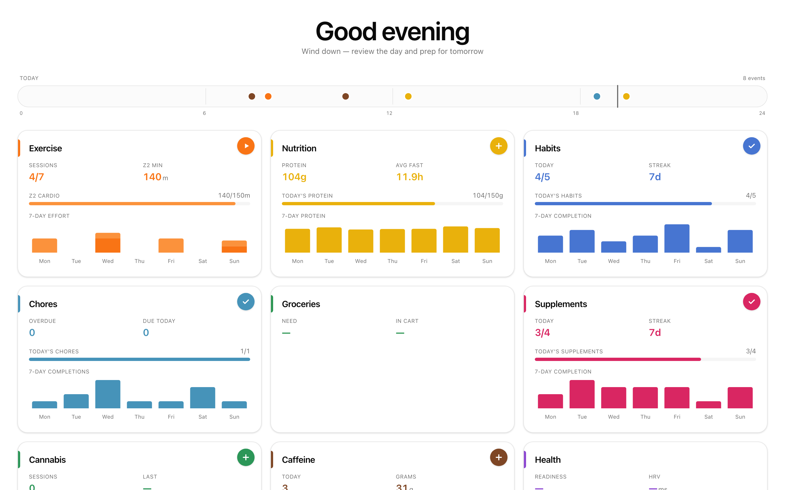

# Setlist

**A local-first personal health dashboard that stores everything as
human-readable YAML inside your Obsidian vault.**

Setlist is one app for several corners of personal health — exercise,
nutrition, habits, sleep, body, vitals, supplements, caffeine, chores —
tracked through a clean web UI, stored as plain text files you
can read, edit, and back up like any other notes.



_Screenshots show demo data — run `npm run seed-demo` to see the app
with data before logging your own._

## Philosophy

- **Your data is yours.** Every event you log is one Markdown file with
  YAML frontmatter in your Obsidian vault. No database, no cloud, no
  account. Delete the app tomorrow and your history is untouched.
- **Obsidian-native.** If you already live in Obsidian, Setlist reads
  and writes into the same vault you already sync. You can see, search,
  edit, and link to any entry from Obsidian itself.
- **One person, one machine.** Setlist is built for a single user on
  localhost, not for multi-tenant deployment. Auth, rate limits, and
  CORS tightening are intentionally absent because the threat model is
  "nobody but me."
- **No hidden state.** Section configuration (habits lists, macro
  targets, supplement stacks) is YAML you edit by hand or through the
  Settings UI. Nothing is baked into the app that you can't see and
  change.

## What you can track

Setlist ships with these sections. Each one is **auto-detected by
whether its folder exists in your vault** — sections you haven't set
up simply don't appear in the nav, and optional integrations stay
hidden until their credentials land.

Each section links to its own page with what it can do, the YAML
schema, and the relevant endpoints.

| Section | What it does | Storage |
|---|---|---|
| [**Exercise**](docs/sections/exercise.md) | Training sessions, progression charts, PR tracking. Pre-fillable templates for upper/lower/cardio/yoga days. | YAML per set |
| [**Nutrition**](docs/sections/nutrition.md) | Meals, supplements, snacks, per-meal macros, rolling daily targets, fasting-window tracking. | YAML per meal |
| [**Habits**](docs/sections/habits.md) | Fixed daily checklist bucketed morning / afternoon / evening with 30-day history. | YAML per day |
| [**Chores**](docs/sections/chores.md) | Recurring, deferrable tasks with overdue tracking. | YAML per chore + per completion |
| [**Supplements**](docs/sections/supplements.md) | Daily stack checklist with streak history. | YAML per day |
| [**Caffeine**](docs/sections/caffeine.md) | V60s, matcha, time-of-day patterns. | YAML per drink |
| [**Sleep**](docs/sections/sleep.md) | Score, stages, trends. | Read-only from Oura / Apple Health |
| [**Body**](docs/sections/body.md) | Weight, body-fat trends. | Read-only from Withings |
| [**Health**](docs/sections/health.md) | HRV, resting HR, steps, VO₂ max, active calories. | Read-only from Apple Health |
| [**Air**](docs/sections/air.md) | Ambient CO₂, temperature, humidity — live band, day-stats, overnight windows. | Read-only from Aranet4 |
| [**Insights**](docs/sections/insights.md) | Cross-section correlations and patterns. | Derived |

The core three — Exercise, Nutrition, Habits — ship as starter
scaffolding under [`examples/vault/Bases/`](examples/vault/Bases/). The
rest live under [`examples/vault/optional/`](examples/vault/optional/),
ready to copy into your vault when you want them.

## Optional integrations

None of these are required. If the token/credential file isn't present,
the section simply shows empty state — the rest of the app still works.

- **Oura Ring** — sleep, readiness, activity. Auth via a personal access
  token.
- **Withings** — weight and body-fat measurements from a Withings scale.
  OAuth2 credentials.
- **Apple Health** — steps, HRV, resting HR, VO₂ max, exercise minutes,
  and sleep (as a fallback when Oura isn't present). Data arrives via the
  [Health Auto Export](https://www.healthyapps.dev/) iOS app posting to a
  local webhook; Setlist reads the resulting JSON snapshot.
- **Aranet4** — ambient CO₂, temperature, humidity, pressure from a
  Bluetooth sensor. Polled locally by `scripts/aranet_poller.py` (launchd
  plist in `scripts/com.setlist.aranet.plist`); readings land in
  `$SETLIST_VAULT/Air/Log/{date}.md` as a daily rollup.

All four are optional and each is independent — wire up as many or as few
as you like.

## Data model

Every event — a rep, a meal, a habit toggle, a chore completion — is one
Markdown file with YAML frontmatter. The minimum shape:

```yaml
---
date: "2026-04-18"
id: "2026-04-18T08:15:00-meal-breakfast"
section: nutrition
# … section-specific fields below
---
```

Files live at `$SETLIST_VAULT/<Section>/Log/`. Filenames vary by section
(e.g. nutrition uses `YYYY-MM-DD--HHMM--NN.md`; exercise uses
`YYYY-MM-DD--{exercise-slug}--NN.md`). Each section has its own parser
but they share `date`, `id`, and `section` across the universe.

See `docs/HEALTH_DATA_SPEC.md` for the health-data pipeline and
`CLAUDE.md` for section-by-section schema notes.

## Try it with demo data

Before committing to your own vault, run Setlist against a disposable
vault of deterministic fake data:

```bash
pip install -r requirements.txt                 # one-time
npm install                                     # one-time
npm run seed-demo                               # generates /tmp/setlist-demo-vault
SETLIST_VAULT=/tmp/setlist-demo-vault \
  SETLIST_INTEGRATIONS_DIR=/tmp/none \
  uvicorn main:app --port 4445 --reload         # backend
npm run dev                                     # frontend → :4444
```

30 days of fake meals, sessions, habits, and supplements appear across
the sections. Delete the folder when done — nothing else is touched.

## Quickstart

**Prerequisites:** Python 3.11+, Node 20+, Obsidian (technically
optional — you can use any folder of Markdown files).

```bash
# 1. Clone
git clone https://github.com/michellzappa/setlist.git
cd setlist

# 2. Point Setlist at a vault (or leave defaults)
cp .env.example .env.local
# edit .env.local — at minimum, SETLIST_VAULT if your vault isn't at
# ~/Documents/obsidian/Bases/

# 3. Install
pip install -r requirements.txt
npm install

# 4. Run (two terminals)
uvicorn main:app --port 4445 --reload        # backend
npm run dev                                   # frontend → :4444
```

Open `http://localhost:4444`. **First run:** if your vault doesn't exist
yet, Setlist shows an onboarding screen with two paths — copy the
starter scaffolding from `examples/vault/Bases/` into a new directory,
or point `SETLIST_VAULT` at an existing Obsidian vault. Once any
section folder is present, that section appears in the nav.

## Configuration

All config is environment variables — Setlist has no global config file.
Defaults work if your Obsidian vault lives at
`~/Documents/obsidian/Bases/`.

| Variable | Default | Purpose |
|---|---|---|
| `SETLIST_VAULT` | `~/Documents/obsidian/Bases` | Where section YAML logs + configs live |
| `SETLIST_HEALTH_DIR` | `~/Documents/obsidian/Health` | Read-only health snapshots folder |
| `SETLIST_INTEGRATIONS_DIR` | `~/.config/openclaw` | Tokens/credentials for Oura/Withings/Apple Health |
| `SETLIST_CACHE_DIR` | `~/.config/setlist` | App-owned scratch space (health cache etc.) |
| `SETLIST_BACKEND_URL` | `http://127.0.0.1:4445` | Where Next.js proxies `/api/*` |
| `SETLIST_DEV_ORIGINS` | `localhost` | Comma-separated hostnames for LAN/Tailscale access |

Full list with comments: [`.env.example`](.env.example).

## Integration setup

### Oura Ring (optional)

1. Get a personal access token at https://cloud.ouraring.com/personal-access-tokens
2. Save it to `$SETLIST_INTEGRATIONS_DIR/oura/token.txt`
3. The Sleep, Health, and Vitals sections will start populating.

### Withings (optional)

1. Register an app at https://developer.withings.com/
2. Complete the OAuth2 flow (we don't ship a helper yet — any OAuth2
   script works) and write the resulting token JSON to
   `$SETLIST_INTEGRATIONS_DIR/withings/token.json`
3. Save your app credentials to
   `$SETLIST_INTEGRATIONS_DIR/withings/credentials.json`:
   ```json
   { "client_id": "...", "client_secret": "..." }
   ```
4. The Body section will start populating. Setlist auto-refreshes the
   token when it expires.

### Apple Health via Health Auto Export (optional)

1. Install [Health Auto Export](https://www.healthyapps.dev/) on iOS.
2. Configure a REST API export destination pointing to your Mac
   (Tailscale / LAN).
3. Run a receiver that writes payloads to
   `$SETLIST_INTEGRATIONS_DIR/health_auto_export/latest.json`.
   See `docs/HEALTH_DATA_SPEC.md` for the expected schema.
4. The Health, Sleep, and Body sections will start populating.

## Using with AI agents

Because every section is plain YAML in a known folder, any AI agent that
can read and write files (Claude, Cursor, Codex, Claude Code, Claude
Desktop) can log data, compute totals, and modify configuration — the
Setlist app doesn't even need to be running.

Every section ships a **`SKILL.md`** describing its file layout, YAML
schema, and agent-friendly examples:

- [`examples/vault/Bases/Nutrition/SKILL.md`](examples/vault/Bases/Nutrition/SKILL.md) — meals, macros
- [`examples/vault/Bases/Exercise/SKILL.md`](examples/vault/Bases/Exercise/SKILL.md) — training sessions
- [`examples/vault/Bases/Habits/SKILL.md`](examples/vault/Bases/Habits/SKILL.md) — habit checklist
- [`examples/vault/optional/Supplements/SKILL.md`](examples/vault/optional/Supplements/SKILL.md), [`Chores`](examples/vault/optional/Chores/SKILL.md), [`Caffeine`](examples/vault/optional/Caffeine/SKILL.md)

Point your agent at the one(s) you need. One skill = one section's
contract; context stays small.

```
/skill examples/vault/Bases/Nutrition/SKILL.md
```

Then:
> "Log breakfast — Greek yogurt with berries and coffee, ~22g protein, ~340 kcal"

The agent writes `$SETLIST_VAULT/Nutrition/Log/{today}--{HHMM}--01.md`
with the correct schema.

See [`SKILLS.md`](SKILLS.md) for the full index and shared conventions.

## Customization

Most section behavior is driven by YAML you edit directly:

- **Macro targets:** `$SETLIST_VAULT/Nutrition/macros-config.yaml` —
  protein/fat/carbs/kcal ranges. Missing file → neutral defaults.
- **Habit list:** `$SETLIST_VAULT/Habits/habits-config.yaml` — what
  habits appear and in which time-of-day bucket.
- **Supplement stack:** `$SETLIST_VAULT/Supplements/supplements-config.yaml`
- **Caffeine sources:** `$SETLIST_VAULT/Caffeine/caffeine-config.yaml`
- **App settings:** `$SETLIST_VAULT/Settings/settings.yaml` — section
  order, animation preferences, fasting/eating window targets, per-section
  enable/disable. Also editable via the Settings tab.
- **Session templates** (gym routine): `lib/session-templates.ts` — the
  one holdout still in TypeScript. Edit this file to match your own
  split / equipment. Slated to move to vault YAML in a later release.

## Architecture

```
setlist/
  app/                      Next.js App Router pages — one folder per section
  components/               React components — one *-dashboard.tsx per section
  hooks/                    Shared React hooks (useSections, useSelectedDate, …)
  lib/
    api.ts                  Typed API client
    sections.ts             Section registry (nav, colors, paths)
    app-config.ts           SWR hook for server-resolved config
    macro-targets.ts        Macro helpers (reads from API)
    session-templates.ts    Gym routine templates (TypeScript, user-editable)
    date-utils.ts           Shared date/time helpers
    day-phases.ts           Time-of-day bucketing helpers
  main.py                   Two-line shim: `from api.app import app`
  api/
    app.py                  FastAPI app, CORS, lifespan, router inclusion
    paths.py                Env-derived filesystem roots
    parsing.py              YAML-frontmatter helpers
    routers/                One file per section (exercise, nutrition, habits,
                            health, settings, sections, meta, …)
  scripts/                  Migration scripts, demo seeder, screenshot pipeline
  examples/vault/           Starter scaffolding: Bases/ (core) + optional/
  skills/                   Top-level agent skills (http-api, adding-a-section)
  docs/                     Schema specs and design notes
```

**Frontend:** Next.js App Router + TypeScript + Tailwind + shadcn/ui +
Recharts. Dev server on port 4444.

**Backend:** FastAPI, entrypoint at `main.py` delegating to `api/app.py`.
One `APIRouter` per section under `api/routers/`. Dev server on port
4445, hot-reloaded with `--reload`. No database — every request re-reads
YAML from disk (cheap at personal-scale data volumes).

**No build step for data.** Edit a YAML file in Obsidian, reload the
page, changes appear. The Exercise section caches for performance and
auto-invalidates on file mtime change.

## Adding your own section

See [`skills/adding-a-section.md`](skills/adding-a-section.md) — the
canonical step-by-step guide covering:

- The five archetypes (per-event log, fixed-set checklist,
  cadence-based, stateful checklist, integration-backed) — pick the
  one that matches your data shape.
- Vault layout + universal YAML frontmatter.
- Backend router + shared parsing helpers from `api/parsing.py`.
- Registry wiring (`api/paths.py`, `api/routers/sections.py`,
  `api/routers/settings.py`, `lib/sections.ts`).
- Dashboard + settings-UI card (DRY pattern — one `ManageXCard` in
  `components/manage-items.tsx`, no new settings page needed).
- Per-section `SKILL.md` so agents can log into the section from day
  one.
- End-of-work checklist.

Copy from the nearest existing section's router + dashboard rather
than writing from scratch.

## Scope and limitations

**What Setlist is not:**
- **Not multi-user.** Running it on a server exposes your data — the
  threat model assumes localhost, LAN, or Tailscale-only.
- **Not a replacement for Oura/Withings/Apple Health.** It reads their
  data; it doesn't send anything back.
- **Not a coaching app.** No training plans, no meal plans, no
  suggestions — just fast entry and visibility into what you've done.
- **Not polished for strangers yet.** This is a personal project opened
  up. Expect rough edges in onboarding and first-run UX while OSS
  adoption matures.

**Known holdouts:**
- Session templates (gym routine) still live in TypeScript — see
  `lib/session-templates.ts`. Moving to vault YAML is tracked.
- `components/training-dashboard.tsx` still mirrors the exercise-type
  sets (`CARDIO_EXERCISES`, `MOBILITY_EXERCISES`, `CORE_EXERCISES`)
  used by `metricKind` to pick the right chart rendering. The backend
  is fully config-driven via `Bases/Exercise/exercise-config.yaml`;
  the dashboard will consume it in a follow-up.

## Contributing

Setlist is a personal project shared publicly under the MIT license.
Issues and PRs are welcome but I only merge changes that match how I
actually use the app. For significantly different flavors,
**fork freely** — the philosophy encourages it.

## Running under `start.sh`

```bash
./start.sh
```

Starts both frontend and backend with logs in `./logs/`. Useful for
putting Setlist behind a launchd or systemd service.
