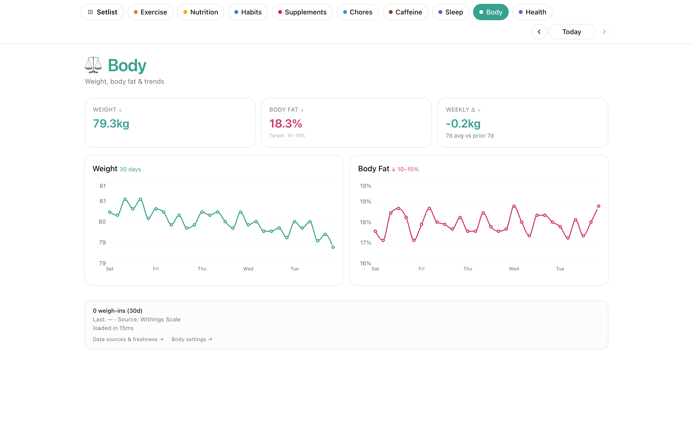

# Body

Read-only view of weight and body-fat trends from a Withings scale.

## What it does

- **Weight over time** with configurable unit (kg/lb, set in Settings).
- **Body-fat percentage** trend on the same timeline.
- **30/90-day trend charts** for visual trajectory.
- **Auto-refreshing token** — Septena refreshes the Withings OAuth2 token when it expires.

No writes — purely read-only. No entries in the vault; everything comes live from Withings.

## Data source

- **Withings OAuth2** credentials at `$SEPTENA_INTEGRATIONS_DIR/withings/credentials.json` and refresh token at `.../withings/token.json`. See [README § Withings setup](../../README.md#withings-optional).

## Endpoints

`GET /api/health/withings`, plus the shared `/api/health/summary` and `/api/health/combined`.
