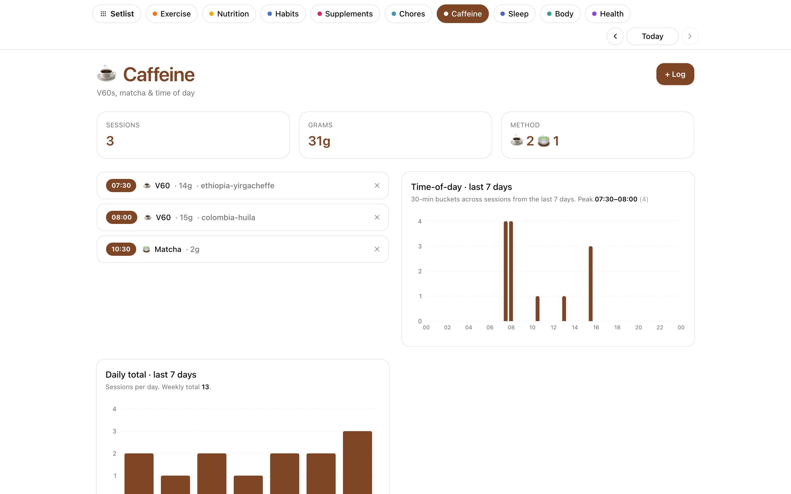

# Caffeine

Log coffee, matcha, and other caffeinated drinks with source and method,
then see time-of-day patterns.

## What it does

- **Bean / source presets** configured in `caffeine-config.yaml` so logging is one tap.
- **Method tracking** — V60, espresso, matcha, etc.
- **Time-of-day patterns** — when you tend to drink, how it relates to sleep (via Sleep section overlap).
- **Per-day and history views.**

## Data shape

One file per drink at `$SEPTENA_DATA_DIR/Caffeine/Log/{date}--{HHMM}--NN.md` with `bean`, `method`, `amount_g`, `section: caffeine`. Bean presets live in `$SEPTENA_DATA_DIR/Caffeine/caffeine-config.yaml`. See [`examples/vault/optional/Caffeine/SKILL.md`](../../examples/vault/optional/Caffeine/SKILL.md).

## Endpoints

`GET /api/caffeine/config`, `GET /api/caffeine/day/{day}`, `POST /api/caffeine/entry`, `DELETE /api/caffeine/entry/{entry_id}`, `GET /api/caffeine/history`, `GET /api/caffeine/sessions`.
