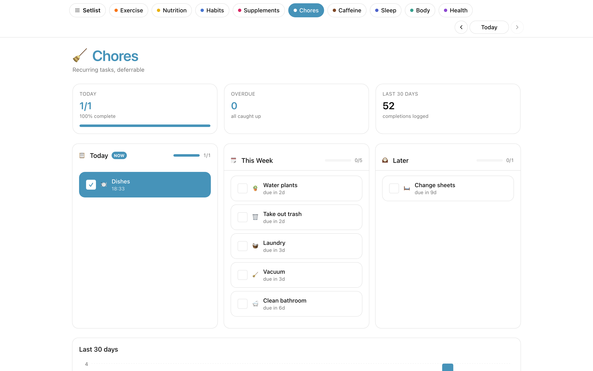

# Chores

Recurring deferrable household tasks, each with its own cadence, tracked
via a replayed event log.

## What it does

- **Per-chore cadence** (every N days) — due date derived from the last completion.
- **Defer by day or to the weekend** — one tap to push without losing the history.
- **Overdue tracking** — sorted by how late, so the most neglected rises to the top.
- **Replayed log model** — no "current state" is persisted. The log of `complete` and `defer` events is authoritative; due dates are recomputed every request.

## Data shape

**Definitions** at `$SEPTENA_DATA_DIR/Chores/Definitions/*.md` — one note per chore with `cadence_days`.

**Events** at `$SEPTENA_DATA_DIR/Chores/Log/*.md` — either `complete` (sets next due = date + cadence_days) or `defer` (sets next due explicitly).

See [`examples/vault/optional/Chores/SKILL.md`](../../examples/vault/optional/Chores/SKILL.md).

## Endpoints

`GET /api/chores/list`, `POST /api/chores/complete`, `POST /api/chores/defer`, `POST/PUT/DELETE /api/chores/definitions`, `GET /api/chores/history`.
