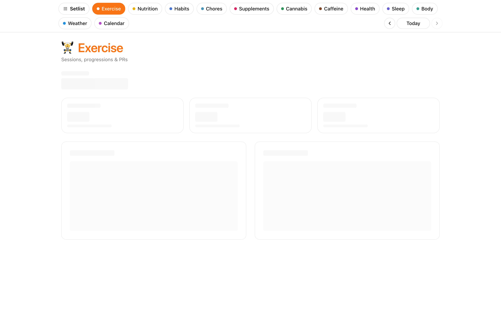

# Exercise

Track strength, cardio, mobility, and yoga sessions with automatic
progression charts and PR tracking.



## What it does

- **Pre-fillable session templates** for upper / lower / cardio / yoga days — start a session and the previous entry for each exercise is suggested as the next target.
- **Progression charts** per exercise (weight × reps over time) with PR markers.
- **Cardio history** (Z2 minutes, distance) and weekly rollups.
- **Summary view** across training types with filters by date range.
- **In-memory cache** with mtime-based invalidation — the only section that caches, because session files dominate the vault.

## Data shape

One file per set at `$SETLIST_VAULT/Exercise/Log/{date}--{exercise-slug}--NN.md`:

```yaml
---
date: "2026-04-18"
time: "08:30"
exercise: "Barbell Squat"
weight_kg: 80
reps: 5
set: 1
session_id: "2026-04-18-lower"
section: exercise
---
```

See [`examples/vault/Bases/Exercise/SKILL.md`](../../examples/vault/Bases/Exercise/SKILL.md) for the full schema.

## Endpoints

`GET /api/exercises`, `GET /api/progression/{exercise}`, `GET /api/summary`, `POST /api/sessions`, `GET /api/sessions/{date}`, `GET /api/next-workout`, `GET /api/cardio-history`. See [CLAUDE.md](../../CLAUDE.md#backend-routes) for the full list.

## Configuration

- **Session templates** (gym routine) live in [`lib/session-templates.ts`](../../lib/session-templates.ts) — the one holdout still in TypeScript. Edit to match your split/equipment.
- **Taxonomies** (what counts as cardio vs. mobility vs. core) are hardcoded in [`api/routers/exercise.py`](../../api/routers/exercise.py) and mirrored in the frontend.
