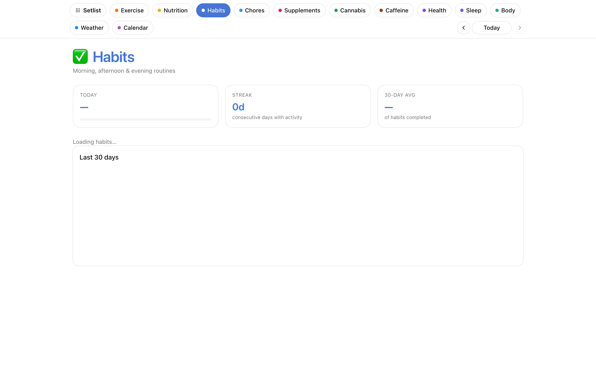

# Habits

A fixed daily checklist of recurring habits, bucketed by time of day,
with a 30-day history grid.



## What it does

- **Fixed set, not ad-hoc** — you configure the list of habits once; each day shows the same checklist.
- **Morning / afternoon / evening buckets** so the list stays contextual to your day.
- **One tap to toggle** — idempotent; toggling off removes the event file.
- **30-day history grid** per habit, showing streaks and gaps at a glance.
- **Edit the list** inline from the settings screen (or edit `habits-config.yaml` directly — existing events stay valid).

## Data shape

**Config** at `$SETLIST_VAULT/Habits/habits-config.yaml`:

```yaml
habits:
  - id: creatine
    name: Creatine 5g
    bucket: morning
  - id: meditation
    name: Meditation 10min
    bucket: morning
```

**Per-completion events** at `$SETLIST_VAULT/Habits/Log/{date}--{habit_id}--01.md`:

```yaml
---
date: 2026-04-11
id: habit-2026-04-11-creatine
section: habits
habit_id: creatine
habit_name: Creatine 5g
bucket: morning
---
```

See [`examples/vault/Bases/Habits/SKILL.md`](../../examples/vault/Bases/Habits/SKILL.md).

## Endpoints

`GET /api/habits/config`, `GET /api/habits/day/{day}`, `POST /api/habits/toggle`, `POST /api/habits/new`, `PUT /api/habits/update`, `DELETE /api/habits/delete/{id}`, `GET /api/habits/history`.
