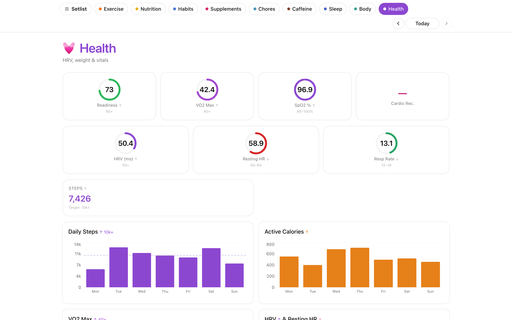

# Health

Read-only view of vitals and activity — HRV, resting HR, steps, VO₂ max,
active calories, exercise minutes.

## What it does

- **HRV** and **resting heart rate** trends from Apple Health (via Health Auto Export) or Oura.
- **Daily step count**, **active energy**, **exercise minutes**, **flights climbed**, **walking/running distance** — summed per day.
- **Episodic metrics** — HRV, VO₂ max, resting HR, respiratory rate, SpO₂, cardio recovery — latest-per-day.
- **Heart rate** averaged per day.

Source priority and exact metric keys live in [`api/routers/health.py`](../../api/routers/health.py) (`APPLE_METRIC_KEYS`, `APPLE_SLEEP_KEYS`). No writes — purely read-only.

## Data source

- **Health Auto Export** iOS app → `$SETLIST_INTEGRATIONS_DIR/health_auto_export/latest.json`.
- **Oura** for HRV and readiness when the token is present.

See [docs/HEALTH_DATA_SPEC.md](../HEALTH_DATA_SPEC.md).

## Endpoints

`GET /api/health/summary`, `GET /api/health/apple`, `GET /api/health/oura`, `GET /api/health/combined`, `GET /api/health/cache`.
