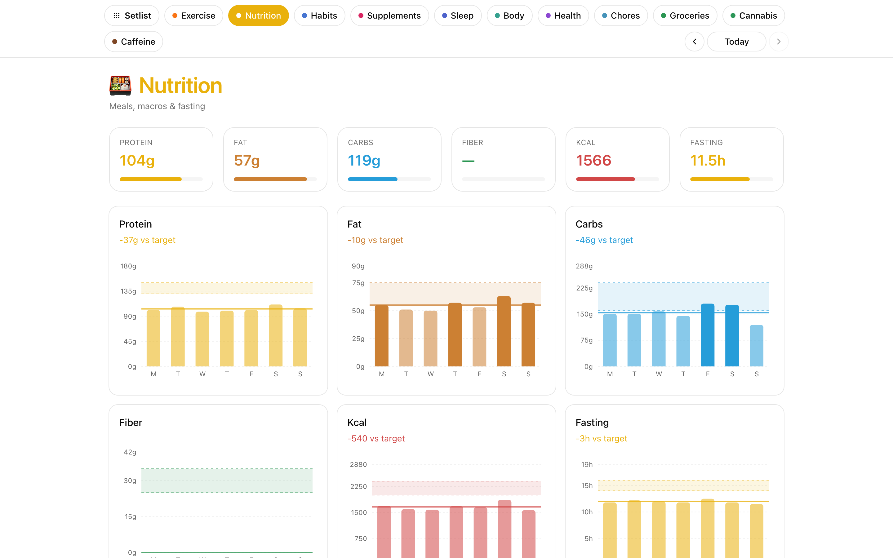

# Nutrition

Log meals with per-meal macros, track daily targets as ranges, and see
your fasting/eating window in real time.



## What it does

- **Inline meal entry** — title + ingredient list + macros (protein/fat/carbs/kcal) + emoji, stored as one YAML file per meal.
- **Rolling daily targets** shown as min–max ranges, not single numbers. Configurable in Settings.
- **Fasting-window tracker** — hours since last meal, target eating window progress.
- **Stats view** — 7/30/90-day macro trends, meal timing patterns.
- **Edit/delete** any past meal from the dashboard.

## Data shape

One file per eating event at `$SEPTENA_DATA_DIR/Nutrition/Log/{date}--{HHMM}--NN.md`:

```yaml
---
date: "2026-04-11"
time: "11:15"
emoji: 🍳
protein_g: 22
fat_g: 14
carbs_g: 30
kcal: 340
foods:
  - Breakfast
  - 2 eggs (~12g protein)
  - Coffee with milk (~2g protein)
section: nutrition
---
First meal of the day
```

`foods[0]` is the title; the rest is the ingredient list. Free-form notes go in the body. See [`examples/vault/Bases/Nutrition/SKILL.md`](../../examples/vault/Bases/Nutrition/SKILL.md).

## Endpoints

`GET /api/nutrition/entries`, `GET /api/nutrition/stats`, `POST/PUT/DELETE /api/nutrition/sessions`, `GET /api/nutrition/macros-config`.

## Configuration

Daily target ranges live in `$SEPTENA_DATA_DIR/Settings/settings.yaml` under `targets.*` (protein/fat/carbs/kcal min+max, fasting/eating window hours). Also editable from the Settings tab.
