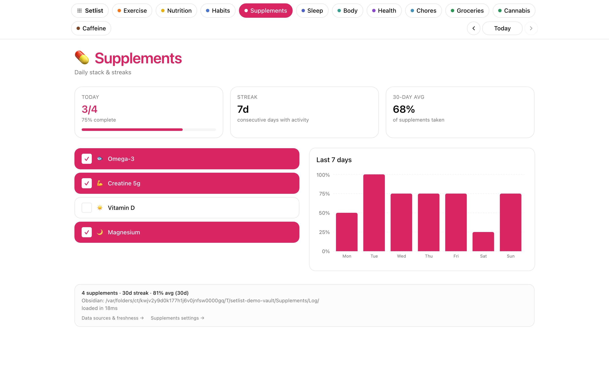

# Supplements

A daily checklist of your supplement stack with streak history.



## What it does

- **Fixed daily stack** — same shape as Habits but without buckets.
- **One tap to log each dose** — idempotent per item per day.
- **Streak history** showing consistency over time.
- **Edit the stack** from the settings screen or by editing `supplements-config.yaml`.

## Data shape

**Config** at `$SEPTENA_DATA_DIR/Supplements/supplements-config.yaml`:

```yaml
supplements:
  - id: omega3
    name: Omega-3 2g
  - id: vitd
    name: Vitamin D 5000IU
```

**Per-dose events** at `$SEPTENA_DATA_DIR/Supplements/Log/{date}--{id}--01.md`, same shape as Habits events (minus `bucket`). See [`examples/vault/optional/Supplements/SKILL.md`](../../examples/vault/optional/Supplements/SKILL.md).

## Endpoints

`GET /api/supplements/config`, `GET /api/supplements/day/{day}`, `POST /api/supplements/toggle`, `POST /api/supplements/new`, `PUT /api/supplements/update`, `DELETE /api/supplements/delete/{id}`, `GET /api/supplements/history`.
